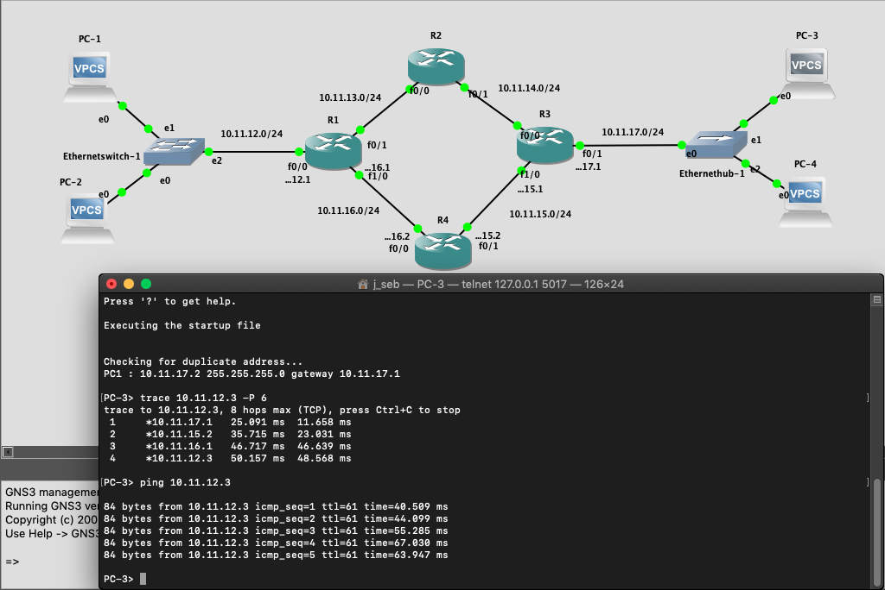

# GNS3-Redes
_<strong><small>* Desarrollo del taller de GNS3 para el curso de Fundamentos de Redes, Universidad del Valle. </small></strong>_

<hr>
Este repositorio contiene los archivos necesarios para la ejecución de un proyecto en GNS3, el cual tiene como objetivo desplegar una topografía de red dada como parte de un taller del curso Fundamentos de Redes.
<br> 
<hr>

## Realizado por:

* Jhon Carlos Valencia P.
* Johan Sebastián Hernández V.

<hr>

### Enunciado
* El estudiante deberá llevar a cabo las siguientes actividades a partir de su primera experiencia con GNS3:
- [x] 1. Desplegar la siguiente topología de red.
<br>


<br>
<strong>Tenga en cuenta lo siguiente: </strong>

   * La red entre R2 - R3 estará identificada por la red ```10.11.14.0/24```
   * La red entre R3 - R4 estará identificada por la red ```10.11.15.0/24```
   * La red entre R4 - R1 estará identificada por la red ```10.11.16.0/24```
   * El segmento de red donde se encuentran R3, PC-3 y PC-4 será la red ```10.11.17.0/24```.
   
- [x] 2. Haga ajustes en las rutas (routes) de los enrutadores de modo que el tráfico de red entre el segmento 10.11.12.0/24 y el segmento 10.11.17.0/24 se haga a través de los enrutadores R1 - R4 - R3.

- [x] 3. Para validar la elaboración de su trabajo usted deberá entregar:
  * Un video donde se muestre la conectividad de PC-3 con PC-2 utilizando las herramientas ping y trace que se encuentra en PC-3. Es decir, su video comenzará con la apertura de GNS3 y de su proyecto cargando la configuración indicada anteriormente. 
  * Una vez cargada su topología de red, muestre claramente que la ruta que siguen los paquetes del PC-3 y PC-2 es la indicada en el ítem 2, R1 - R4 - R3. 
  * Elimine/borre el enrutador R4 y haga las modificaciones que corresponda para que ahora el tráfico de red entre el segmento 10.11.12.0/24 y el segmento 10.11.17.0/24 es R1 - R2 - R3.
  
<hr>

### Resultados

<hr>
<br>

1. <strong> Despliegue de la topografía inicial: </strong>


2. <strong> Resultados de ajustes realizados a topografía original: </strong>



3. <strong> Topografía nueva ahora con el tráfico entre R1 - R2 - R3: </strong>


